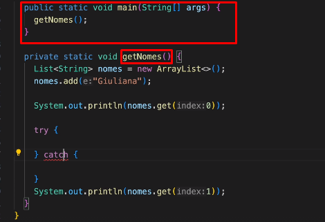
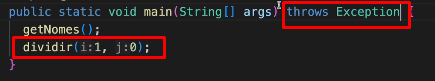

# Trabalhando com Exceptions

## Referência: Curso de Desenvolvimento Java, Giuliana Silva Bezerra
[Compre aqui](https://www.udemy.com/course/curso-de-desenvolvimento-java/)
<hr>

## Tópicos

- [O que são exceções?](#o-que-são-exceções)
- [Capturando Exceções Específicas](#capturando-exceções-específicas)
- [Capturando Múltiplas Exceções](#capturando-múltiplas-exceções)
- [Lançando Exceções com o Throw](#lançando-exceção-com-o-throw)
- [Exceções Checáveis vs Não Checáveis](#exceções-checáveis-vs-não-checáveis)
- [Exceções Personalizadas](#exceções-personalizadas)

<hr>

## O que são exceções?

Quando escrevemos um programa, devemos nos preparar para algo dar errado. Seja por erro do programador,
do próprio usuário que pode prover dados errados ou coisas imprevisíveis mesmo.

Vamos imaginar um array com uma posição.

```java
import java.util.ArrayList;
import java.util.List;

List<String> nomes = new ArrayList<>();
nomes.add("Pedro");

System.out.println(nomes.get(1));
```

Aqui, tentamos acessar uma posição que não existe. Isso dará uma exceção chamada "IndexOutOfBoundsException".

Bom, essa exceção ela basicamente foi "cuspida", para o console de forma meio bruta. A ideia é tratar essa
exceção, para que o programa continue respondendo mandando até mesmo uma mensagem mais "amigável".

Para que possamos fazer isso, colocaremos esse código dentro um método estatico (abaixo do main), e 
trabalharemos esse código dentro de um bloco try-catch.



Aqui ☝️, o array + add sendo colocado dentro de um método estático fora do Main, chamado getNomes 
(que será inicializado no Main).

```java
private static getNomes() {
    List<String> nomes = new ArrayList<>();
    nomes.add("Pedro");
}

try {
    System.out.println(nomes.get(1));
} catch(Exception e) {
    //e.printStackTrace();
    System.out.println("O índice informado não é válido.")
}
```
StackTrace é a pilha de logs de erro. Onde ele começou até onde ele terminou. Se a gente deixar ele ser
imprimido, será exibido o que estava ali em cima.

Para que fique uma mensagem amigável, escrevemos o que de fato está ocorrendo para o usuário.
<hr>

## Capturando Exceções Específicas

Uma exception pode ser várias coisas. Então podemos exibir uma mensagem mais específica do que a que foi
informada acima no catch.
```java
try {
    System.out.println(nomes.get(1));
} catch(IndexOutOfBoundsException e) {
    System.out.println("O índice informado não é válido.")
}
```

Ao invés de capturar a ``Exception``, somente (algo mais genérico), passamos de fato o erro que será exibido.
<hr>

## Capturando Múltiplas Exceções

E se no nosso bloco try aparecer outra exceção? Bom, o try-catch nos permite capturar múltiplas exceções, veja:
```java
try {
    //primeiro catch
    System.out.println(nomes.get(1));
    
    //segundo catch
    int resultado = 10 / 0;
} catch(IndexOutOfBoundsException e) {
    System.out.println("O índice informado não é válido.")
} catch(ArithmeticException e) {
    System.out.println("Operação aritmética inválida!")
}
```
<hr>

## Lançando exceção com o Throw

Uma outra forma de lançarmos exceção é com o Throws.

Como assim? Bom, ao invés de trabalhar com o try-catch, podemos usar o Throws new! Veja:

Abaixo temos um método que fará uma divisão básica. Mas caso o denominador informado pelo usuário 
seja zero, lançará uma exceção.

O unico problema é o seguinte. Sempre que resolvermos lançar uma exceção dessa forma sem o try-catch,
ela precisa ser TRATADA, no método. Escrevendo ``throws Exception``, depois dos ().
```java
private static int dividir(int i, int j) throws Exception {
    if (j == 0) {
        throw new Exception("Não é possivel realizar divisão por zero.");
    }
    return  i / j;
}
```

Todos os métodos que chamarem um método que recebe essa exceção, DEVEM realizar o mesmo throws em sua linha.

Se o Main chamar esse método dividir, terá que tratar da mesma forma com o ``throws Exception``.


<hr>

## Exceções Checáveis vs Não Checáveis

**Exceções Checáveis - Exception:** Precisam estar declaradas no método ou no construtor, conforme mostrado 
[acima](#lançando-exceção-com-o-throw) ☝️. E dentro desse método que vai chamar esse método (Main,
por exemplo, alguem vai precisar tratar essa exceção com try-cacth eventualmente.

**Não Checáveis - RunTimeException**: Se passar dentro do if a exceção de uma vez conforme abaixo, 
ela não vai extender uma Exception igual acima. Ela extenderá uma **RunTimeException**. Ou seja, não
precisa ser checada ou validada no método, pois em tese elas irão interromper o programa.

```java
private static int dividir(int i, int j) {
    if (j == 0) {
        throw new IllegalArgumentException("Não é possivel realizar divisão por zero.");
    }
    return  i / j;
}
```
<hr>

## Exceções Personalizadas

Ao longo da nossa carreira, muitas vezes teremos a necessidade de criar as nossas exceções. Como?

Para esse método acima, criaremos uma classe "DivisaoPorZero". Essa classe extenderá RunTimeException. 
Além disso, criamos um construtor para gerar a mensagem de erro! Usamos o **super()** para referenciar
a classe pai (RunTimeException), e passamos a message. Veja:
```java
public class DivisaoPorZero extends RuntimeException {
    public DivisaoPorZero(String message) {
        super(message);
    }
}
```
E agora dentro do método, ao invés de lançar uma ``IllegalArgumentException``. Poderemos fazer o seguinte:

```java
private static int dividir(int i, int j) {
    if (j == 0) {
        throw new DivisaoPorZero("Não é possivel realizar divisão por zero.");
    }
    return  i / j;
}
```

